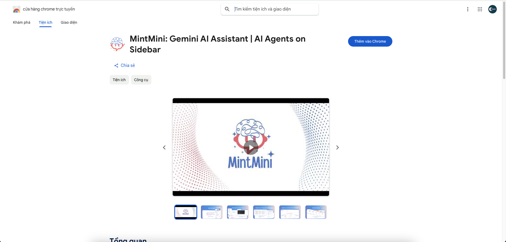
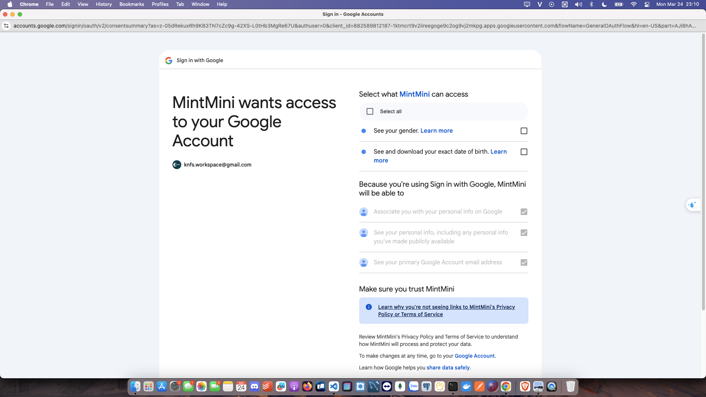
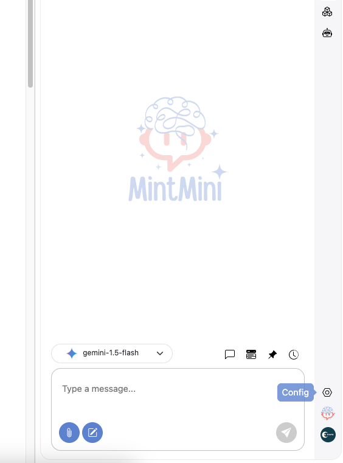
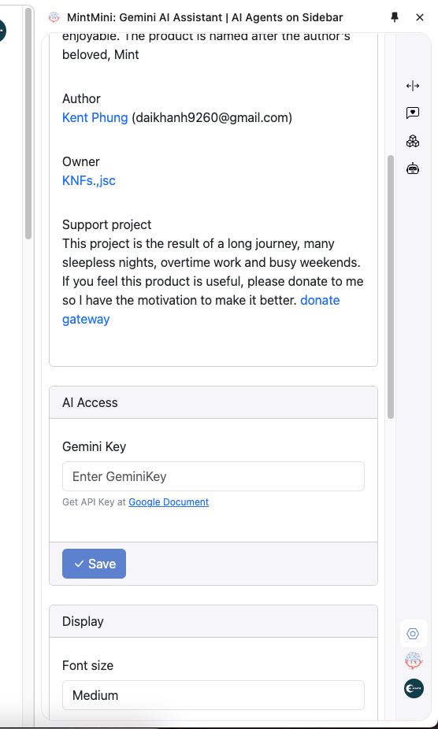
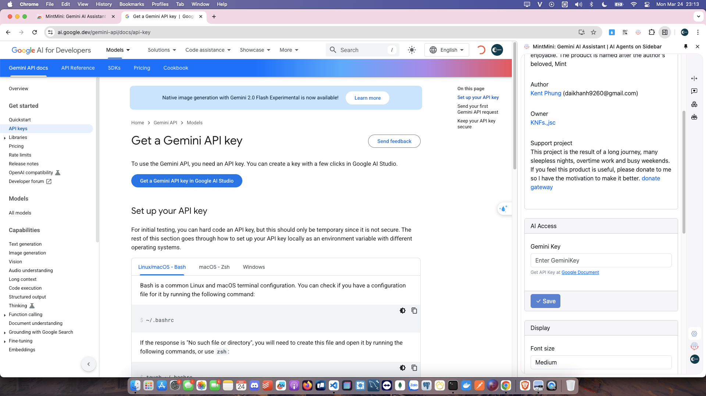
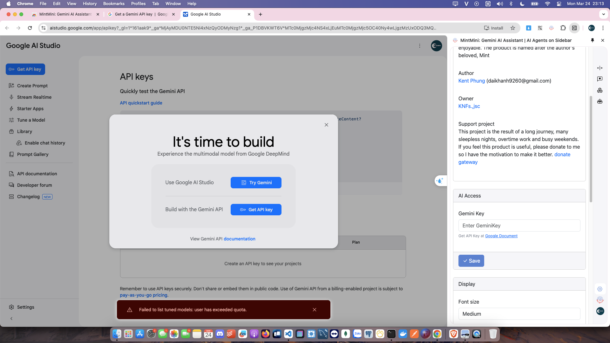
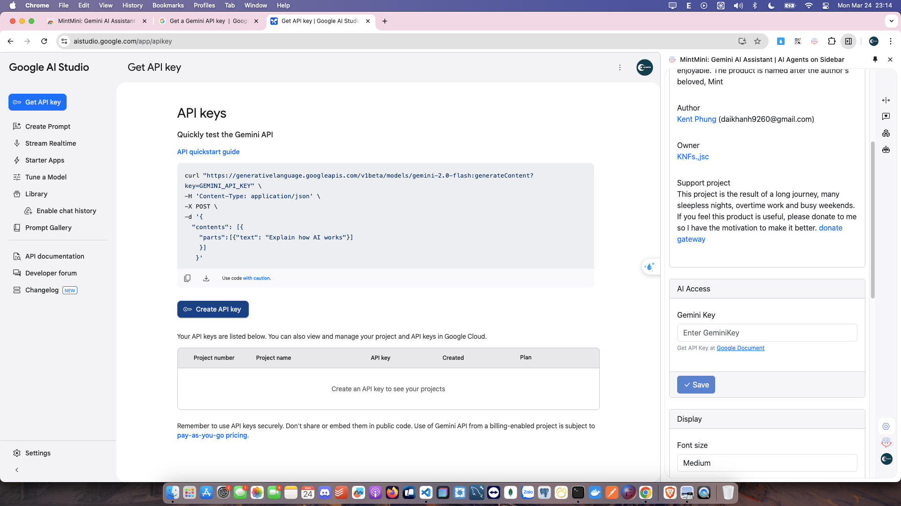
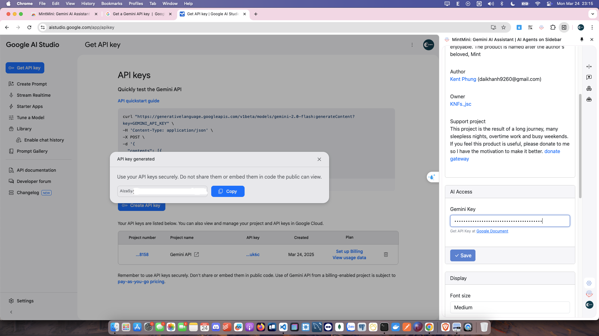
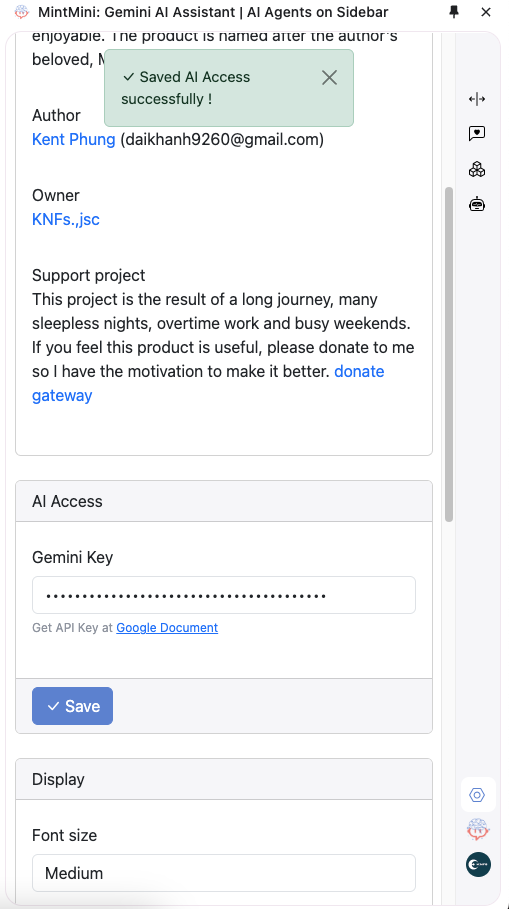
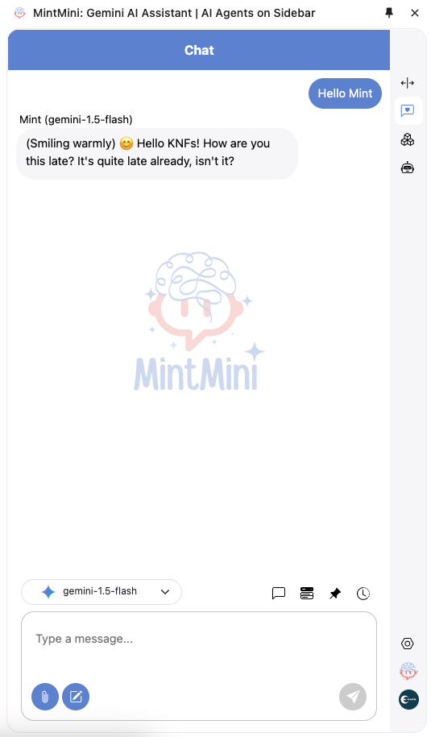

# MintMini: Your Smart, Friendly AI Companion

MintMini is a free AI assistant that helps you create personalized AI Agents with chat, roles, and task automation.

## Getting Started

Here's how to get started with MintMini:

1.  **Install MintMini from the Chrome Web Store:**
    *   Go to the [Chrome Web Store](https://chromewebstore.google.com/detail/mintmini-gemini-ai-assist/illcmddggpiehbmecgheminlppaoepno).
    *   Click the "Add to Chrome" button.
    

2.  **Grant Permissions:**
    *   After installation, you'll be prompted to grant Google Auth permissions.
    *   Select "Select all" to grant all necessary permissions.
    *   Click "Continue".
    
    

3.  **Configuration:**
    *   Once installed, you'll see a config icon. Click on it.
    

4.  **Gemini AI Access:**
    *   In the configuration panel, find the "Gemini AI Access" section.
    *   Click on "Google Document" to get your API key.
    

5.  **Get Gemini API Key:**
    *   Clicking "Google Document" will redirect you.
    *   Click "Get API Key".
    
    
    *   Click "Create API Key".
    
    *   Copy the generated API key.
    

6.  **Enter API Key in MintMini:**
    *   Paste the copied API key into the "AI Access" input field in MintMini.
    *   Click "Save".
    

7.  **Success!**
    *   You'll see a success message. 🎉
    *   MintMini is now ready to use!

8. **Start first message**
   *   You start with first message
   

## Features

*   **Smart Conversations:** Chat naturally with MintMini.
*   **Image Uploads:** Upload images up to 500MB.
*   **Customizable Roles:** Choose from pre-built Roles or create your own.
*   **Action Creation:** Set up Actions to automate tasks.
*   **Personalized AI Agent:** Customize the interface and how your AI interacts.

Enjoy MintMini – smart, friendly, and completely free! 🎉
