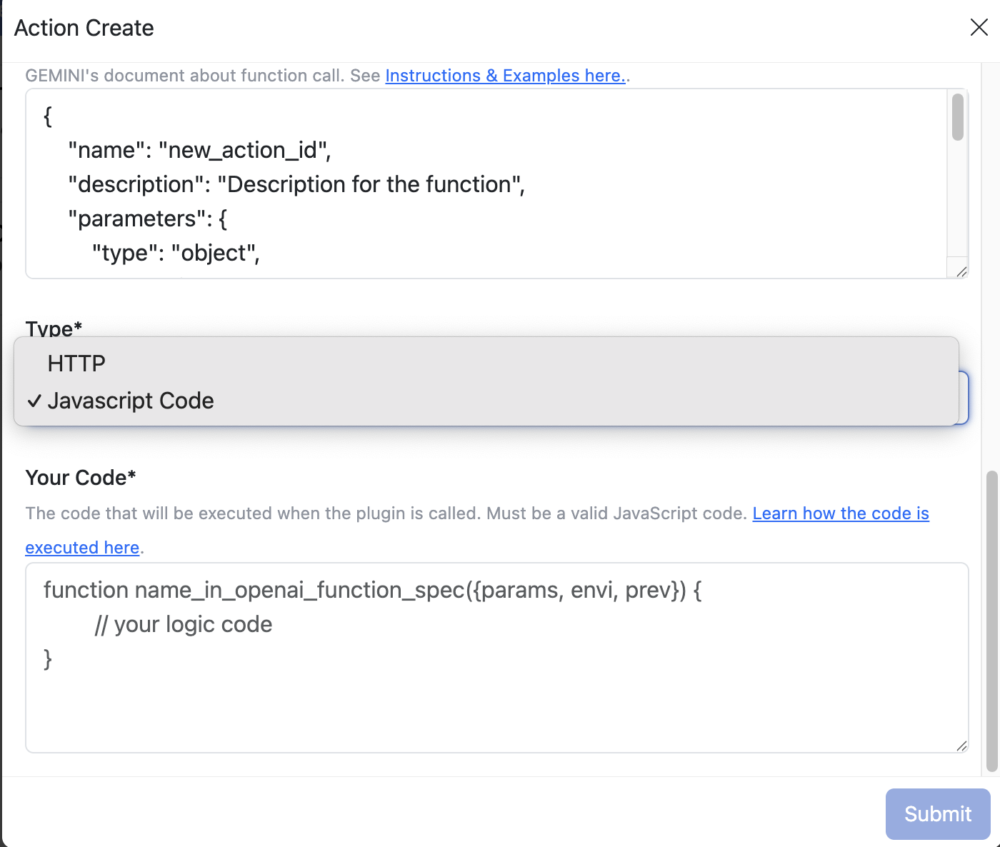

# Function Code Actions

[Back to Top](#function-code-actions) | [Next: HTTP Actions (http.md)](#http-actions-httpmd)

This document explains how to create Function Code Actions in MintMini. Function Code Actions allow you to execute custom JavaScript code within your AI Agent.

## What are Function Code Actions?

Function Code Actions enable you to extend the capabilities of your AI Agent by writing custom JavaScript code that can perform specific tasks. This allows you to integrate complex logic and calculations into your AI.

## Creating Function Code Actions

To create a new Function Code Action in MintMini:

1.  Go to the Actions configuration panel.
2.  Click "+ Create" to start creating a new Action.
3.  Enter the relevant information for the Action:
    *   **Action Name:** A name to be shown to the user.
    *   **Icon Url:** A URL to an icon for the Action.
    *   **Overview:** Describe to the users what your plugin does and how to use it with examples. Markdown is supported.
4.  Choose `Javascript Code` type
    
5.  Write your Javascript code in the `Your Code` input
    
6.  Make sure the code is a valid Javascript Code
7.  The function must be called with name `name_in_openai_function_spec` with 3 params `params`, `envi` and `prev`
    *   `params`: The parameters defined in GEMINI Function Spec
    *   `envi`: Environment variable
    *   `prev`: The result of previous action. If there's no previous action, it's `null`

## Tips for Effective Function Code Actions

*   **Clear Function Definition:** Ensure your function definition accurately reflects the action it performs.
*   **User-Friendly Descriptions:** Provide clear and concise descriptions for your Actions to help users understand their purpose.
*   **Test Thoroughly:** Test and refine your Actions to ensure they work as expected.

With Function Code Actions, you can create a powerful and versatile AI Agent that can automate a wide range of tasks. 🎉
