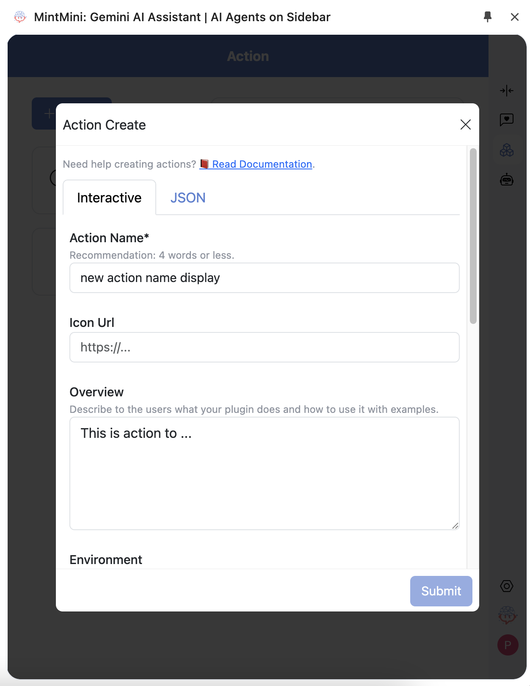

# Actions in MintMini

- [Actions in MintMini](#actions-in-mintmini)
  - [What are Actions?](#what-are-actions)
  - [Creating Actions](#creating-actions)
  - [GEMINI Function Spec](#gemini-function-spec)
  - [Examples of Actions](#examples-of-actions)
  - [Tips for Effective Actions](#tips-for-effective-actions)

Actions are the tasks that your AI Agent can perform. They are based on Gemini's function calling mechanism, allowing you to extend the capabilities of your AI.

## What are Actions?

[Back to Top](#actions-in-mintmini) | [Next: Creating Actions](#creating-actions)

Actions enable your AI to interact with the real world and automate tasks for you. By configuring Actions, you can customize your AI to perform specific functions based on your needs.

## Creating Actions

[Back to Top](#actions-in-mintmini) | [Next: GEMINI Function Spec](#gemini-function-spec)

To create a new Action in MintMini:

1.  Go to the Actions configuration panel.
2.  Click "+ Create" to start creating your own Action.
    
3.  Enter the relevant information for the Action:
    *   **Action Name:** A name to be shown to the user.
    *   **Icon Url:** A URL to an icon for the Action.
    *   **Overview:** Describe to the users what your plugin does and how to use it with examples. Markdown is supported.
    
4.  Define the function and parameters for the Action. You can choose Interactive or JSON type

## GEMINI Function Spec

[Back to Top](#actions-in-mintmini) | [Next: Examples of Actions](#examples-of-actions)

✅ Make sure it’s in the correct JSON format.
Follow the instructions in GEMINI document to understand how to write one. You can see the spec of existing plugins like Simple Calculator, JavaScript Interpreter, or the Generate Random Number example plugin below for reference.
✅ Unique Function Name
Note that the name field of the spec must be unique across all plugins you currently have. This is because GEMINI API will use this name to call the function, having multiple functions with the same name will confuse the AI.
✅ Use meaningful names & descriptions
It’s important to provide a meaningful function name, function description, parameter name, parameter description, etc.
The AI will use these names and descriptions to understand and decide when to use your function. Providing a meaningful and accurate name will help the AI use your function/plugin better.
✅ Example of a JSON GEMINI Function Spec:
```json
{
  "name": "generate_random_number_in_range",
  "description": "Generate a random integer number between number 'a' and number 'b'.",
  "parameters": {
    "type": "object",
    "properties": {
      "a": {
        "type": "number",
        "description": "The number a (the smaller number)"
      },
      "b": {
        "type": "number",
        "description": "The number b (the larger number)"
      }
    },
    "required": [
      "a",
      "b"
    ]
  }
}
```
## Examples of Actions

[Back to Top](#actions-in-mintmini) | [Next: Tips for Effective Actions](#tips-for-effective-actions)

Here are some examples of how you can use Actions:

*   **Sending Emails:** Configure your AI to send emails on your behalf.
*   **Data Analysis:** Set up Actions to analyze data and provide insights.
*   **Data Retrieval:** Enable your AI to search for specific data and information.
*   **Web Search:** Integrate web search capabilities into your AI Agent.

## Tips for Effective Actions

[Back to Top](#actions-in-mintmini) 

*   **Clear Function Definition:** Ensure your function definition accurately reflects the action it performs.
*   **User-Friendly Descriptions:** Provide clear and concise descriptions for your Actions to help users understand their purpose.
*   **Test Thoroughly:** Test and refine your Actions to ensure they work as expected.

With Actions, you can create a powerful and versatile AI Agent that can automate a wide range of tasks. 🎉

---

**Next Steps:**

*   Learn about [HTTP Actions](/actions/http.md)
*   Learn about [Function Code Actions](/actions/function-code.md)
